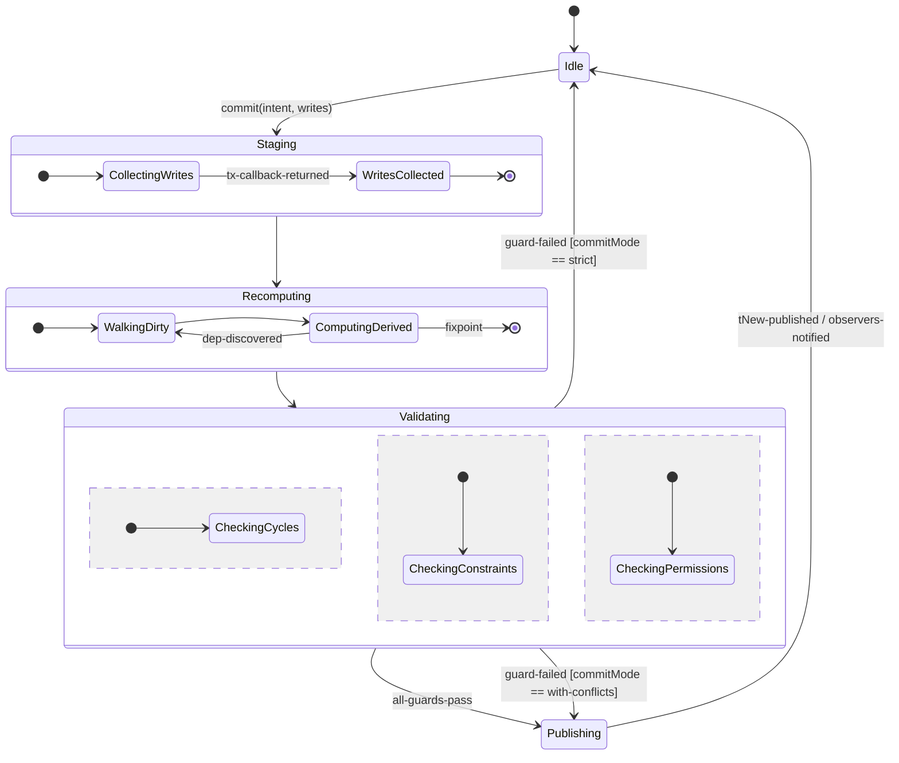
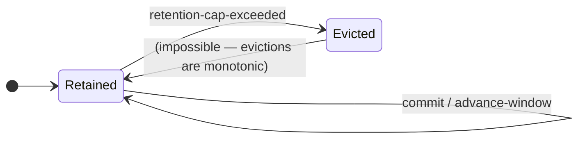
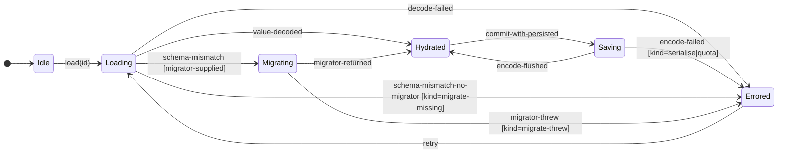

# Causl Composite Lifecycle

> Drawn before any conflict or resource code is written. If I cannot draw the engine on one composite chart, I do not yet know what I am building. (`SPEC.md` §6, §17.2)

## 0. Why one chart

The previous draft had at least five state machines hiding as flat enums (`NodeStatus`, `ResourceNode.status`, the 13-step transaction lifecycle, `Conflict` status, interaction mode). None of them had transition rules; the relationships between them were left to "the implementer's good intentions." David Harel's response: until the relationships are drawn, there is no system, only a wishlist of states.

This page draws **one composite statechart** with hierarchy and orthogonal regions. The four "policies" that previously named themselves separately (`AsyncCommitPolicy`, `CyclePolicy`, `commitMode`, conflict resolution policy) are *guard expressions on transitions* in this chart, sharing one event vocabulary. They are no longer independent enums.

As of v0.9.0 the **Engine** region (the leftmost orthogonal region below) is the shipped surface. The `ResourceFleet` and `ConflictRegistry` regions are drawn here because the engine's transitions reference their event vocabulary, but their implementations remain deferred to the `@causl/sync` adapter epic and the conflict-view derived (see `SPEC.md` §13.6, §13.7); they ride on top of the Engine without changing its internal transitions.

## 1. The composite chart

```mermaid
stateDiagram-v2
    direction TB

    [*] --> CauslLifecycle

    state CauslLifecycle {
        direction TB

        state Engine {
            direction TB
            [*] --> Idle
            Idle --> Committing : commit(intent, writes)
            Committing --> Idle : publish / notify

            state Committing {
                direction TB
                [*] --> Staging
                Staging --> Recomputing : writes-staged
                Recomputing --> Validating : derived-stable
                Validating --> Publishing : all-guards-pass
                Validating --> [*] : guard-failed [strict]
                Validating --> Publishing : guard-failed [with-conflicts]
                Publishing --> [*] : tNew-published
            }
        }

        --

        state ResourceFleet {
            direction TB
            note right of ResourceFleet
              one orthogonal sub-statechart per registered resource;
              deferred to the @causl/sync adapter (SPEC §13.6),
              referenced by the Engine via guards on Validating.
            end note
            [*] --> ResourceIdle
            state Resource {
                direction LR
                ResourceIdle --> Loading : fetch-begin
                Loading --> Loaded : fetch-resolve [origin == tNow]
                Loading --> Stale : fetch-resolve [origin != tNow]
                Stale --> Loading : refetch
                Loading --> Errored : fetch-reject
                Errored --> Loading : retry
                Loaded --> Stale : dep-changed
                Loaded --> Errored : invalidate(error)
            }
        }

        --

        state ConflictRegistry {
            direction TB
            note right of ConflictRegistry
              one orthogonal sub-statechart per open conflict;
              ships as a derived view over the engine's commit
              log (no separate store).
            end note
            [*] --> Open
            state Conflict {
                direction LR
                Open --> Resolved : resolve(choice)
                Open --> Ignored : ignore
                Open --> Superseded : new-conflict-on-same-target
            }
        }
    }
```

### 1.1 Engine region — closer look



The three sub-regions of `Validating` (cycles, constraints, permissions) are **orthogonal**: they run concurrently and all must pass for `all-guards-pass`. If any fails, the guard expression on the outgoing transition decides the response — `strict` rolls back; `with-conflicts` publishes and records a `Conflict`.

## 2. Event vocabulary

Every transition in the chart reacts to one of these events. New events do not appear in implementations without a row here.

| Event | Source | Allowed in regions |
| --- | --- | --- |
| `commit(intent, writes)` | application | Engine: `Idle → Staging` |
| `hydrate(snap)` | application | Engine: `Idle → Staging` — privileged caller of the same pipeline. Internally pre-validates `schema`/`schemaHash`, filters the snapshot down to known input ids, then drives the same Phase A–H body that `commit` does. The published `Commit` carries `intent: 'hydrate'` and `originatedAt: snap.time`; `now` advances by exactly one tick. There is no separate hydrate edge — the Engine region has one mutation pipeline (#366, #378, SPEC §3, §5). |
| `tx-callback-returned` | engine | Engine: `Staging → Recomputing` |
| `dep-discovered` | engine | Engine: re-enters `ComputingDerived` |
| `derived-stable` | engine | Engine: `Recomputing → Validating` |
| `all-guards-pass` | engine | Engine: `Validating → Publishing` |
| `guard-failed` | engine | Engine: `Validating → Publishing | Idle` (guarded by `commitMode`) |
| `tNew-published` | engine | Engine: `Publishing → Idle`; emits to subscribers |
| `fetch-begin` | application/`@causl/sync` | ResourceFleet: `ResourceIdle → Loading` |
| `fetch-resolve` | external (network) | ResourceFleet: `Loading → Loaded | Stale` |
| `fetch-reject` | external (network) | ResourceFleet: `Loading → Errored` |
| `dep-changed` | engine | ResourceFleet: `Loaded → Stale` |
| `resolve(choice)` | application | ConflictRegistry: `Open → Resolved` |
| `ignore` | application | ConflictRegistry: `Open → Ignored` |
| `new-conflict-on-same-target` | engine | ConflictRegistry: `Open → Superseded` |

## 3. Guard expressions

Where the previous draft had separate enums, the chart has guards on transitions. The guard is the discriminator.

| Transition | Guard | Replaces |
| --- | --- | --- |
| `Validating → Idle` on `guard-failed` | `commitMode == 'strict'` | `commitMode` (was 6 values) |
| `Validating → Publishing` on `guard-failed` | `commitMode == 'with-conflicts'` | `commitMode` |
| `Loading → Loaded` on `fetch-resolve` | `originGraphTime == currentGraphTime` | `AsyncCommitPolicy` (was 4 values) |
| `Loading → Stale` on `fetch-resolve` | `originGraphTime != currentGraphTime` | `AsyncCommitPolicy` |
| `Recomputing → Validating` cycle path | `cyclePolicy == 'detect'` | `CyclePolicy` (was 4 values) |
| `Open → Superseded` on `new-conflict-on-same-target` | application-supplied conflict-resolution comparator | reconciliation policy (was 4 values) |

The four enums collapse to **two enum-shaped guards** (`commitMode`, `cyclePolicy`) plus **two extension points** (the per-resource origin check, the per-conflict comparator). The application supplies the latter; the engine provides the former.

## 4. Invariants the chart enforces

These follow from the shape of the chart and are checked in the shipped property suite (`SPEC.md` §15.1):

- **One commit ⇒ one `tNew-published`.** The path `Idle → Staging → Recomputing → Validating → Publishing → Idle` is acyclic; `Publishing` emits exactly once. (Atomicity.)
- **No observer wakes mid-staging.** `Publishing` is the only state that emits to subscribers. (Atomicity.)
- **Failed guards never land writes when `strict`.** `Validating → Idle` is the only edge out on `guard-failed [strict]`; it bypasses `Publishing`. (Strict-commit semantics.)
- **A `Stale` resource never satisfies a derived that depends on `Loaded`.** The discriminated union `Resource = Loading | Loaded | Stale | Errored` (`SPEC.md` §9) makes `.value` access require a tag check. (Compile-time race elimination.)
- **A `Superseded` conflict's `resolve(choice)` is a no-op.** The chart has no transition out of `Superseded`; the type system makes `resolve` unreachable from that state. (Conflict registry coherence.)

## 5. Adapter regions extending the chart

Two later landings extend the chart with orthogonal regions whose
transitions reference the Engine vocabulary above. The spec §17.7
commitment forbids "parallel string-enums sprinkled across object
fields" — when a new tag family ships, it gets a region here before
it ships in code.

### 5.1 RetentionWindow region

`RetentionResult<T>` (`packages/core/src/types.ts`) is the read-side
discriminator returned by `graph.readAt(t)` and `graph.snapshotAt(t)`
on the shipped bounded retention buffer (filled by Phase F.6 of the
commit pipeline; see `SPEC.md` §5.1).



| Event | Source | Allowed transitions |
| --- | --- | --- |
| `commit` | engine | Retained → Retained (window slides forward) |
| `retention-cap-exceeded` | engine | Retained → Evicted for the displaced GraphTime |

The transition is monotonic per-GraphTime: a time `t` once evicted
never returns to retained. `RetentionResult` is therefore a *read
projection* over the window, not a state the value occupies — the
discriminator is the answer to "is `t` still in the buffer at
read time," computed on demand. Retention is governed by
`snapshotRetentionCap` (default 50) and surfaced via
`graph.readAt` / `graph.snapshotAt` as `{ status: 'evicted',
oldestRetainedTime }` when the request falls outside the window.

### 5.2 PersistedInput region

`PersistenceError` (`packages/persistence/src/persistedInput.ts`) is
the lifecycle of a persisted input attempting an I/O round-trip. The
kinds (`parse | migrate-threw | migrate-missing | serialise | quota`)
are not parallel enums — they are reachable states of the persistence
sub-statechart. `migrate-threw` and `migrate-missing` are *distinct*
states: the former is the failure of an application-supplied migrator,
the latter is a schema mismatch with no migrator on hand. Encoding
both as the presence/absence of an optional `cause?` on a single
`migrate` tag was the §17.4 violation #370 retired.



| Event | Source | Allowed transitions |
| --- | --- | --- |
| `load(id)` | application | Idle → Loading |
| `decode-failed` | persistence | Loading → Errored [kind=parse] |
| `schema-mismatch` | persistence | Loading → Migrating (when migrator supplied) |
| `schema-mismatch-no-migrator` | persistence | Loading → Errored [kind=migrate-missing] |
| `migrator-returned` | application-supplied migrator | Migrating → Hydrated |
| `migrator-threw` | application-supplied migrator | Migrating → Errored [kind=migrate-threw] |
| `commit-with-persisted` | engine | Hydrated → Saving |
| `encode-failed` | persistence | Saving → Errored [kind=serialise|quota] |
| `retry` | application | Errored → Loading |

The `PersistenceError.kind` discriminator is the guard expression on
which `Errored` transition fired. New kinds require a new transition
in this chart, not a new string in the union — and per §17.7 every
kind in the union is a reachable state in this chart.

### 5.3 ObserverError region

`ObserverErrorContext.source` (`packages/core/src/types.ts`) tags
the dispatch site of a thrown observer. Three values, three
sources:

| `source` | Dispatch site |
| --- | --- |
| `subscribe-initial` | the synchronous initial-emit on `subscribe(node, observer)` |
| `node-subscriber` | the post-publish dispatch of a per-node observer |
| `commit-subscriber` | the post-publish dispatch of a `subscribeCommits` observer |

These are not states the engine occupies; they are *call-site
labels* on the error edges leaving Engine `Publishing`. The set is
closed: any new dispatch path adds a row before it ships.

### 5.4 WhyReason region

`WhyReason` (`packages/devtools/src/why.ts`) tags the outcome of
the lineage explainers `whyUpdated` and `whyNotUpdated`. The six
values are not states the engine occupies; they are *call-site
labels* on the explainer functions, each anchored to a chart-named
edge of the §1.1 Engine region. The labels classify whether the
explained node was carried by the most recent `Publishing` edge in
the supplied commit window, and — when it was not — which Engine
guard or short-circuit accounts for the absence.

| `reason` | Explainer | Engine edge / guard described |
| --- | --- | --- |
| `recomputed` | `whyUpdated` | `Publishing` fired with the explained node in `changedNodes`, reached via `Recomputing → Validating` (the node was rewalked during `Recomputing.WalkingDirty → ComputingDerived` and propagated). |
| `directly-set` | `whyUpdated` | `Publishing` fired with the explained node in `changedNodes`, reached via `Staging` (the node was written inside the `Staging.CollectingWrites` callback, not produced by recomputation). |
| `no-cause` | `whyUpdated` / `whyNotUpdated` | No `Publishing` event in the window touched the node — every commit observed by the explainer left `changedNodes` disjoint from `{ node }`. |
| `did-update` | `whyNotUpdated` | The latest `Publishing` event *did* include the node in `changedNodes`; the caller's premise was wrong. |
| `no-dep-overlap` | `whyNotUpdated` | `Publishing` fired but `changedNodes ∩ deps(node) = ∅`; the commit affected unrelated parts of the graph and the engine never re-entered `Recomputing` for this node. |
| `object-is-deduped` | `whyNotUpdated` | `Publishing` fired and dependencies overlapped, so `Recomputing.ComputingDerived` ran for the node, but the value the engine produced was `Object.is`-equal to the prior one and the post-publish notification short-circuit suppressed the propagation edge to subscribers. |

| Event | Source | Allowed transitions |
| --- | --- | --- |
| `whyUpdated(graph, node)` | application | yields `recomputed` \| `directly-set` \| `no-cause` per the table above; returns a `DerivedNode<WhyResult>` registered through `commitMetadataDerived` so subscribers fire on the commit that produced the answer (Phase F.5, post-`commitLog` refresh). |
| `whyNotUpdated(graph, node)` | application | yields `did-update` \| `no-dep-overlap` \| `object-is-deduped` \| `no-cause` per the table above; same `DerivedNode<WhyResult>` shape and Phase F.5 scheduling. |

The set is closed: any new `WhyReason` tag adds a row above —
naming the §1.1 Engine edge or guard it describes — before it
ships in code. This mirrors §5.3's discipline for
`ObserverErrorContext.source`: the chart names the transition; the
tag names the call-site label on it.

## 6. What this page does *not* cover

- **The application-layer interaction modes** (selecting, drawing, idle, …) belong to the editor-controller layer (`SPEC.md` §7.2), which is **not** in `@causl/core`. They will appear in their own statechart in the application code, with `Msg` events crossing into the engine via `commit`.
- **Multi-user merge.** Two clients each producing their own `GraphTime` is a future-epic problem.
- **Devtools UI.** The chart is not a UI; it is the contract the engine and the resource adapter and the conflict view all share.

## 7. Implementation correspondence

The shipped **Engine** region maps to the `commitInternal` body in
`packages/core/src/graph.ts` (the function starts around line 3507; the
Phase A–H markers below mirror the comments inside that function and
`SPEC.md` §5.1). The chart's states correspond to the SPEC's named
phases as follows:

| State | Code surface | `SPEC.md` §5.1 phase |
| --- | --- | --- |
| `Idle` | `Graph` instance with no in-flight commit; reads return committed snapshot | — |
| `Staging.CollectingWrites` | inside `commit(intent, tx => …)` callback execution | A |
| `Staging.WritesCollected` | callback returned, staged-write set frozen; live input table updated, gated by `Object.is`; `now` advances; `lastWriteTime` stamped on each input that actually changed | B, C, C.5 |
| `Recomputing.WalkingDirty` / `ComputingDerived` | Kahn-ordered recompute fixpoint over the affected sub-graph; populates `derivedRollback` for the catch arm | D |
| `Validating.CheckingCycles` | first-commit cycle detector (back-edge probe on the residue of the Kahn pass) | folded into D |
| `Validating.CheckingConstraints` | reserved (constraints remain deferred; see `SPEC.md` §13) | — |
| `Validating.CheckingPermissions` | reserved (permissions are out-of-scope for `@causl/core`) | — |
| `Publishing` | frozen `Commit` assembled; bounded `commitHistory` ring buffer extended; `commitLogEntry.value` refreshed; opt-in `commitMetadataDerived` set recomputed against the just-refreshed log; per-commit input snapshot retained; per-node and per-commit subscribers dispatched | E, F, F.4, F.5, F.6, G, H |

Phases F, F.4, F.5, F.6, G, and H each carry a precondition gate
(SPEC §5.1 Amendment 1, #715): they only run when there is observable
work to do — e.g. F.4 is dead when `commitHistoryCap === 0` and
`commitLog` has no consumer; G is dead when `changed.size === 0`. The
gates are observation-equivalent to running the work, so the chart's
edges are unchanged; the implementation simply skips dead phases.

Phase B's "publish writes" walk uses the input-layer fast path landed
in PR #976: a typed `inputRollbackEntries` array carries the resolved
`InputEntry` references straight into Phase C.5, replacing the
per-iteration `entries.get(id)` + `kind === 'input'` recheck. Lazy
node minting and other registration-time iterative-but-eager seams
(PRs #985 / #1010 / #956) sit *outside* the chart's transitions:
they change *how* `Recomputing.ComputingDerived` and the registration-time
eager evaluator do their walks, not which edges fire.

Adapter packages that extend the chart (the §5 regions —
`RetentionWindow`, `PersistedInput`, `ObserverError`, `WhyReason`)
ride on top of the shipped Engine and do not change its internal
transitions.
